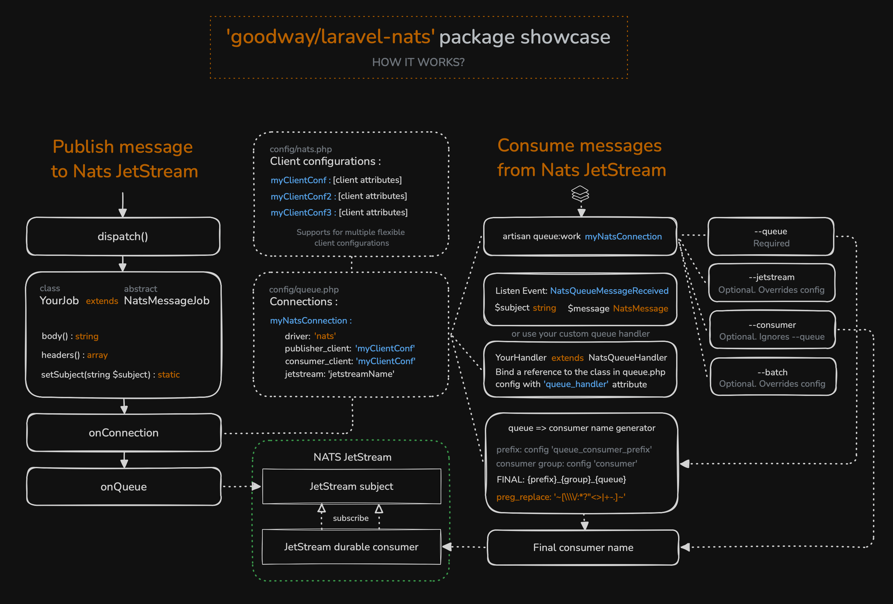

# Nats JetStream queue driver for Laravel

With multiple flexible client and queue configurations,
with events and customizable handlers


[](https://packagist.org/packages/goodway/laravel-nats)
[](https://github.com/goodway/laravel-nats/releases)
[](https://packagist.org/packages/goodway/laravel-nats)
[](https://packagist.org/packages/goodway/laravel-nats)

---



Feel free to contribute or give any feedback.

- [Prerequisites](#prerequisites)
- [Installation](#installation)
- [Configuration](#configuration)
- [Publishing](#publishing-to-queue)
- [Listening](#listening-from-queuejetstream-subject)
- [Message](#message-object-structure)
- [Events](#events)

## Prerequisites

#### Laravel Version
This package can be used in Laravel 8 or higher. The minimum PHP version required is 8.1

#### Config file
This package publishes a config/nats.php file. 
If you already have a file by that name, you must rename or remove it,
as it will conflict with this package.
You could optionally merge your own values with those required by this package,
as long as the keys that this package expects are present.
See the source file for more details.

#### Nats Client
As a Nats client 
we use an external [basis-company/nats.php](https://github.com/basis-company/nats.php) package - 
the most popular, well-written and functional Nats client for PHP.
Greatest thanks to Dmitry Krokhin ([nekufa](https://github.com/nekufa))!


## Installation
The recommended way to install the library is through [Composer](http://getcomposer.org):
```bash
$ composer require goodway/laravel-nats
```

You should publish 
the [config/nats.php](https://github.com/goodway/laravel-nats/blob/main/config/nats.php) 
config file with:
```bash
$ php artisan vendor:publish --provider="Goodway\LaravelNats\LaravelNatsProvider"
```

## Configuration

### Client connection

The client connection configuration is specified in the config/nats.php file.
Multiple configuration supported
```
    'client' => [
        'configurations' => [
            'default' => [
                'host' => env('NATS_HOST', 'localhost'),
                'port' => intval(env('NATS_PORT', 4222)),
                'user' => env('NATS_USER'),
                'password' => env('NATS_PASSWORD'),
                'token' => env('NATS_TOKEN'), // Sets an authorization token for a connection
                'nkey' => env('NATS_NKEY'), // new, highly secure public-key signature system based on Ed25519
                'jwt' => env('NATS_JWT'), // Token for JWT Authentication
                'reconnect' => env('NATS_RECONNECT', true),
                'connection_timeout' => floatval(env('NATS_CONNECTION_TIMEOUT', 1)), // Number of seconds the client will wait for a connection to be established
                'verbose_mode' => env('NATS_VERBOSE_MODE', false), // Turns on +OK protocol acknowledgements
                'inbox_prefix' => env('NATS_INBOX_PREFIX', '_INBOX'), // Sets default prefix for automatically created inboxes
                'ping_interval' => intval(env('NATS_PING_INTERVAL', 2)), // Number of seconds between client-sent pings
                'ssl_key' => env('NATS_SSL_KEY_FILE'),
                'ssl_cert' => env('NATS_SSL_CERT_FILE'),
                'ssl_ca' => env('NATS_SSL_CA_FILE'),
            ],
            ...
        ]
    ]
```


### Queue connection

Describe the queue connection configuration in your 'config/queue.php' file.
It supports multiple client configurations.

Example:
```
    'nats' => [
        'driver' => 'nats',
        'consumer_client' => 'default', // client configuration name from nats.php config file to listen queue
        'publisher_client' => 'default', // client configuration name from nats.php config file to publish queue
        'jetstream' => env('NATS_JETSTREAM', 'jetstream'),
        'jetstream_retention_policy' => env('NATS_JETSTREAM_RETENTION_POLICY', 'workqueue'),
        'consumer' => env('NATS_CONSUMER_GROUP', 'consumer'),
        'consumer_iterations' => intval(env('NATS_CONSUMER_ITERATIONS', 3)),
        'queue_consumer_create' => (bool)env('NATS_QUEUE_CONSUMER_CREATE', false),
        'queue_consumer_prefix' => env('NATS_QUEUE_CONSUMER_PREFIX', 'con'),
        'queue_separated_clients' => env('NATS_QUEUE_SEPARATE_IDENTICAL_CLIENTS', true), // separate Nats clients with the identical configuration
        //            'queue_handler' => 'someClass',
        'fire_events' => (bool)env('NATS_QUEUE_MESSAGE_EVENTS', true),
        'default_batch_size' => intval(env('NATS_DEFAULT_BATCH_SIZE', 10)),
        'verbose_mode' => (bool)env('NATS_QUEUE_VERBOSE_MODE', true),
        'check_jetstream_publish' => (bool)env('NATS_QUEUE_CHECK_JETSTREAM_PUBLISH', false)
    ],
```


Fields description:

- **driver** - [string] queue driver name. Use 'nats'
- **consumer_client** - [string] client configuration name used to listen queue
- **publisher_client** - [string] client configuration name used to publish messages
- **jetstream** - [string] nats jetstream name
- **jetstream_retention_policy** - [string] jetstream retention policy. Used on queue listening to generate the correct consumer name
- **consumer** - [string] consumer group. Used for the final name of the consumer
- **consumer_iterations** - [int, optional, 2] how many times message request should be sent
- **consumer_delay** - [float, optional, 1] how long to wait (in sec.) before sending the next request if an empty response was received
- **queue_consumer_create** - [bool] if true, Queue will try to automatically create a new consumer if one is not found.
This functionality only works if the current connection client has the necessary permissions to create a consumer
- **queue_consumer_prefix** - [string] consumer prefix. Used for the final name of the consumer
- **queue_separated_clients** - [bool] see description below
- **fire_events** - [bool] if true then events will be fired during the publishing and handling received messages processes
- **default_batch_size** - [int, optional, 10] batch size. How many messages would be requested from nats stream
- **queue_handler** - [string, optional] classname of your custom queue handler. If not defined, then the standard handler will be used
- **verbose_mode** - [bool, optional, false] var_dump some additional info. For example on publishing
- **check_jetstream_publish** [bool, optional, false] - additionally check for the existence of a jetstream with each PUB.
When enabled, it can significantly slow down performance because in this case an additional request-response to the Jetstream API is required

You can specify one connection for publisher and another one for consumer,
or use one connection for both roles.

You can also use one or separate connections
if the publisher client configuration name matches the consumer client configuration.
Use this feature through the **"queue_separated_clients"** bool attribute.

## Publishing to queue

The easiest way to send a message to queue is to call a dispatch() method on a simple class
that extends NatsMessageJob. The class must contain a body() method
that will return the contents of the message.
Return type for body() is string.

Example:
```
use Goodway\LaravelNats\NatsMessageJob;

class TestNatsJob extends NatsMessageJob
{
    public function body(): string
    {
        return json_encode([
            'msd_id' => $this->msgId,
            'push_data' => ['some_field' => md5($this->msgId)]
        ]);
    }
}
```

You can also use a dynamic body by passing content through the constructor.

NatsMessageJob class uses Dispatchable and Queueable concerns and implements classic ShouldQueue interface.
Examples:

```
dispatch((new TestNatsJob())
    ->onConnection('nats')
    ->onQueue('jetstream_subject');
```
```
TestNatsJob::dispatch()
    ->onConnection('nats')
    ->onQueue('jetstream_subject');
```

You can also specify the subject and jetstream for message using the \$subject
and \$jetstream variables
```
class
    protected string $subject = 'mySubject';
```
or
```
dispatch((new TestNatsJob())
    ->setSubject('mySubject'))
    ->onConnection('nats')->onQueue('queue-name');
```

### DispatchNats

This package provides an additional dispatch mechanism
and a corresponding helper with the **dispatchNats()** function.
It supports additional functions designed to make it easier
to understand and interact with publishing.

With **dispatchNats** You can set a specific jetstream or subject
when dispatching a job. And also specify whether to call events.

**Examples:**

With helper function
```
dispatchNats((new TestNatsJob())
    ->onConnection('nats')
    ->onJetstream('jetstream_name')
    ->onSubject('jetstream_subject')
    ->withEvents();
```
With class static function
```
TestNatsJob::dispatchNats()
    ->onConnection('nats')
    ->onJetstream('jetstream_name')
    ->onSubject('jetstream_subject')
    ->withoutEvents();
```


### Headers

You can set a message headers using the headers() method of your class. Example:

```
class TestNatsJob extends NatsMessageJob
{
    public function headers(): array
    {
        return [
            'header1_key' => 'header1_value',
            'header2_key' => 'header2_value',
        ];
    }
    ...
}
```


## Listening from queue/jetstream subject

You can connect and listen to messages from the queue using standard **queue:work** mechanism.
Example:

```
php artisan queue:work nats --queue=queue-name
```

### queue:work command options (Recommended)

This package also extends the **queue:work** command and provides
additional options that allow you to specify a jetstream and consumer you want to connect to,
as well as to set the batch size for reading messages.

```
php artisan queue:work nats --jetstream=jetstream --consumer=durable_consumer --batch=50 --queue=any-name
```
**--consumer** option ignores the **--queue** option.
In this case, the **--queue** option will not be used in the connection logic,
it is only needed for visual recognition of the queue for the developer.

## Message object structure

```
{
    "body": [string] any string: plain text, json-string or serialized data of your message
    "headers": [array] headers array
    "subject": [string] subject value
    "timestamp": [int] timestamp in ms
}
```

## Events

These events are fired during the publishing and listening processes.

### NatsQueueMessageSent

This event is fired after a message is sent to the queue
```
class NatsQueueMessageSent
    ...
    public function __construct(
        public readonly string $jetstream,
        public readonly string $subject,
        public readonly NatsMessage $message
    ) {}
```

### NatsQueueMessageReceived

This event is fired when a message is received from the queue
```
class NatsQueueMessageReceived
    ...
    public function __construct(
        public readonly string $jetstream,
        public readonly string $subject,
        public readonly NatsMessage $message
    ) {}
```


---
#### More documentation will be added soon...

...

